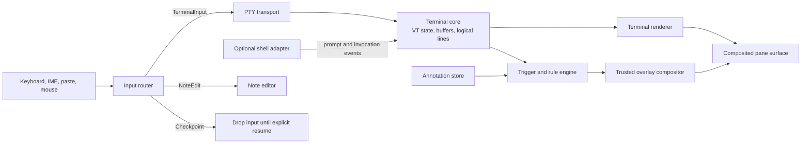

# Contextual terminal memory and input checkpoints

- Status: S1–S3 specification frozen and implementation sequenced; S4 deferred; S5/S6 rejected
- Date: 2026-09-20
- Design intake: [`contextual-terminal-memory-design-decisions.md`](contextual-terminal-memory-design-decisions.md)
- Product decisions: [`contextual-terminal-memory-product-slices.md`](contextual-terminal-memory-product-slices.md)
- Scope and triggers: [`contextual-terminal-memory-scope-trigger-semantics.md`](contextual-terminal-memory-scope-trigger-semantics.md)
- Data and privacy: [`contextual-terminal-memory-data-persistence-privacy.md`](contextual-terminal-memory-data-persistence-privacy.md)
- Overlay and interaction: [`contextual-terminal-memory-overlay-editor-accessibility.md`](contextual-terminal-memory-overlay-editor-accessibility.md)
- Checkpoint feasibility: [`contextual-terminal-memory-checkpoint-feasibility.md`](contextual-terminal-memory-checkpoint-feasibility.md)
- Architecture and rollout: [`contextual-terminal-memory-architecture-verification-rollout.md`](contextual-terminal-memory-architecture-verification-rollout.md)
- Implementation plan: [`contextual-terminal-memory-implementation-plan.md`](contextual-terminal-memory-implementation-plan.md)
- Target: Dart Terminal

## Current decision status

The product center is a GUI-native, sticky-note-like surface for short terminal context, not a
spatial session canvas or a command-security product. The visual reference is an affordance reference:
cards, color, grouping, and direct manipulation should feel native to a GUI, but Miro's layout,
toolbar, collaboration model, and brand are not requirements.

- S1 Basic memory and S2 Park / next focus are adopted for the initial release slice. S2 does not
  block terminal input.
- S3 Next prompt is adopted as the next increment after S1/S2 acceptance.
- S4 Invocation receipt is deferred. S5 Exact-command checkpoint and S6 Simulation / observe are
  rejected from this product roadmap after the Gate 6 zsh and trust-boundary review.
- The initial attachment is `This Terminal`, backed by a durable note-context identity that is separate
  from live pane and PTY-session IDs. Workspace and invocation scopes are deferred.
- `On Return` is a non-blocking, once-per-arm focus transition. `At Next Prompt` requires a matching
  shell-integration instance and a complete post-arm C→D→A/N→B lifecycle.
- Initial notes are bounded plain text stored in a separate, versioned local store. The app does not
  encrypt that store itself, command text/digests are not stored, and note content is excluded from
  diagnostics, logs, analytics, crash metadata, the PTY, and restoration data by default.
- Explicit note export and logical deletion are adopted. Import is deferred, and deletion does not
  claim physical erasure from filesystem snapshots or external backups.
- Notes use opaque, theme-aware colored cards in one pane-anchored trailing rail. The interactive
  AppKit child surface overlays the terminal without changing rows, columns, the Metal drawable, or
  PTY size; the existing system notice badge remains a separate higher layer.
- A due rail may open without taking keyboard or VoiceOver focus. Explicit note interaction uses one
  generation-bound window input owner, and the native multiline editor uses explicit Save/Cancel;
  autosave, durable drafts, rich text, and checkpoint controls are absent.
- The current schema, shell integration, and UI reserve no command matcher, digest, bidirectional
  adapter, checkpoint owner, or simulation mode. Reconsideration requires a separate product proposal.
- The application-root Note authority, store/native protocols, restoration hash binding, local kill
  switches, verification budgets, and staged rollout are frozen in the linked architecture record.
- The linked product decision and implementation records supersede the original all-in-one MVP and
  implementation order below. Product work is authorized only in the registered CM-01→CM-19 order.

## Purpose

Add a PTY-independent memory layer to the terminal. A user can attach a note to a workspace, session, completed command invocation, or exact future command. The same note can remain passive, reappear when the user returns to a session, appear when the next prompt is ready, or become an input checkpoint that must be acknowledged before this terminal client submits a command.

The terminal remains a conventional terminal with tabs, splits, and windows. Notes are rendered by a trusted overlay compositor above the terminal surface; they are never inserted into the terminal byte stream, scrollback, or cell grid. Vim, Codex, tmux, and other full-screen TUI applications therefore retain their normal geometry and rendering behavior.

The proposal deliberately ships with no host, repository, Kubernetes, or dangerous-command rules enabled by default. Every active rule is created or explicitly enabled by the user. The onboarding example uses only a synthetic `echo "caution test"` command in a fake terminal.

## Background

The design discussion began with a terminal whose sessions could be arranged on a whiteboard-like canvas and connected with arrows. That model can visualize relationships, but it does not by itself improve the frequent act of using a shell. Existing tabs, splits, windows, and terminal multiplexers already provide compact session organization and simultaneous operation.

Two ideas remained valuable after rejecting the canvas as the primary interface: user-authored information should coexist with a terminal without becoming shell output, and that information should be able to affect the user's next interaction without changing the child process. This proposal develops those ideas into a focused terminal feature.

## Product decision

Do not build an infinite whiteboard or spatial session canvas as the primary interface. Tabs, splits, windows, and multiplexers already arrange concurrent sessions well. Positioning sessions on a large canvas adds navigation cost without creating a frequent terminal workflow.

The useful idea from the whiteboard exploration is independent annotation: people need to leave intent, context, and warnings beside terminal work without sending that material to the shell. The proposal turns that idea into contextual memory with a lifecycle rather than a general-purpose drawing surface.

The novelty target is the composition of four properties:

1. Human-authored information exists outside the PTY and cannot alter terminal state.
2. It is attached to durable terminal concepts rather than screen coordinates.
3. It can resurface at a meaningful transition such as session return, prompt readiness, or exact command submission.
4. When requested by the user, it can temporarily own input before any bytes reach the shell.

Shell history, prompt plug-ins, terminal layouts, static session notes, and command-warning tools each cover part of this behavior. The proposed experience is the transition from a passive note into a return cue, prompt breakpoint, or pre-submit checkpoint while preserving an ordinary terminal underneath.

## Problem

Terminal users routinely carry state that the shell does not know:

- why a server was left running;
- what must be checked when returning to an SSH session;
- which assumption made a migration command valid;
- what a long-running command is expected to produce;
- why an exact command is unusual in one personal workflow;
- what should happen after a full-screen editor or agent completes its current task.

Command history can recover text that was executed. It does not recover the user's intent, unfinished thought, or warning at the moment it becomes useful. A shell hook can print a warning, but it writes into the shell-controlled presentation and is unavailable while a full-screen application owns the terminal. A separate notes application preserves prose, but loses the connection to terminal events and input.

## Product principles

### Preserve the terminal contract

The PTY remains the source of terminal content. Notes must not emit ANSI sequences, reserve terminal rows, modify scrollback, move the cursor, or cause `SIGWINCH`. Hiding or showing a note must not change the number of rows or columns reported to the child process.

### Keep authorship with the user

The product does not infer that a host, repository, namespace, or command is dangerous. Users create notes and rules from their own context. Optional context providers may be added later, but they only expose facts and never create policy by themselves.

### Be quiet until a note is due

Normal terminal use should look and behave like a normal terminal. Passive notes collapse to a small pane-level badge. Expanded overlays appear on demand or at a trigger the user selected.

### Treat checkpoints as assistance, not security

This feature helps prevent an operator mistake in one terminal client. It is not an authorization boundary, policy engine, sandbox, or permanent deny mechanism. Commands can still be run from another terminal, process, script, or client.

### Degrade honestly

Pre-submit interception is available only when a shell adapter can hold the command before submission. Without that integration, the application may show passive and event-based notes, but it must not claim that it can stop a command before execution.

## Proposed experience

### 1. Memory rail

Every terminal pane has a small overlay affordance in its trusted chrome. It sits above the terminal renderer and does not occupy a terminal cell. The collapsed state shows only the number and urgency of due notes. Opening it reveals the notes associated with the current workspace, session, and recent command invocations.

An expanded note may temporarily cover part of the terminal, just like a popover. Closing it reveals the untouched terminal surface underneath. In the alternate screen, persistent annotations remain collapsed in pane chrome unless the user explicitly opens them.

### 2. Create a note without leaving the terminal

A terminal shortcut enters `NoteEdit` mode. Keyboard, IME, paste, and mouse events are routed to the note editor and no input is forwarded to the PTY. Saving or cancelling the note returns input ownership to the terminal without synthesizing keystrokes.

The creation sheet asks for three decisions:

- **Attach to:** workspace, current session, or selected command invocation;
- **Show:** always in the rail, next time this session is focused, when the next prompt is ready, or before an exact command is submitted;
- **Behavior:** inform only or require acknowledgement before terminal input resumes.

The defaults are a session-scoped passive note and no input hold.

### 3. Park with intent

When leaving a pane running Vim, Codex, a REPL, logs, or a remote shell, the user can choose **Park with intent** and write a short return cue. On the next focus, the note appears above the pane. An optional input checkpoint prevents an accidental keystroke from reaching the old session until the user chooses **Resume**.

This makes session switching safer without changing the TUI or requiring an application-specific integration.

### 4. Continue at the next prompt

A note can be scheduled for the next prompt-ready event. This is useful after a build, migration, test run, file transfer, data job, or agent task. The note stays out of the live output and appears only when shell integration reports that the command has finished and the prompt is ready again.

Examples include:

- "Compare the generated schema before committing."
- "If the count is non-zero, save the IDs before retrying."
- "Restart the local proxy after this transfer finishes."

An optional checkpoint can hold subsequent input until the note is acknowledged. Output continues to render while the checkpoint is visible.

### 5. Attach a note to a command receipt

Shell integration gives each completed invocation a stable identifier. A user can attach findings or intent to that invocation without relying on a row and column in scrollback. The association survives reflow, font changes, window resizing, and scrollback compaction while the receipt remains retained.

The first version does not place arbitrary sticky notes over individual cells. A command receipt exposes a note indicator, and opening it shows the note in the memory rail. This avoids brittle positioning and works with wrapped output.

### 6. Add an exact-command checkpoint

A user may convert a note into a personal rule for an exact command buffer. When an integrated shell is about to accept that exact buffer, it asks the terminal client for a decision before submitting it. The overlay shows the user's own explanation and offers:

- **Run once**;
- **Edit command**;
- **Cancel**;
- **Disable this rule**.

The first implementation performs byte-exact matching, excluding the final Enter/newline. It does not use fuzzy matching, semantic risk scores, aliases, substring rules, or automatic command classification. This makes the behavior explainable: a visually different command is a different command.

### 7. Simulate before enabling

Rule creation follows this lifecycle:

`Draft -> Synthetic simulation -> Observe only -> Explicit enable -> Active`

The simulator renders a fake terminal and demonstrates the checkpoint using `echo "caution test"`. It does not write to a real PTY. Observe-only mode records that the rule would have matched and shows a non-blocking event in the memory rail. The user must explicitly promote the rule to active.

## Note and rule model

The product uses one underlying memory object instead of separate systems for sticky notes, tips, cautions, and guards.

| Field | Meaning |
| --- | --- |
| `id` | Stable application identifier |
| `body` | User-authored Markdown-lite text |
| `scope` | Workspace, session, invocation, or exact-command matcher |
| `trigger` | Passive, next focus, next prompt, or pre-submit |
| `delivery` | Badge, expanded overlay, or input checkpoint |
| `state` | Draft, active, snoozed, resolved, expired, or disabled |
| `provenance` | User-created, imported template, or future provider-assisted draft |
| `created_at` / `updated_at` | Audit and ordering metadata |

An exact-command matcher should use a per-install keyed digest of the accepted command bytes. Its visible label is user-authored. Retaining the raw command is optional and should be encrypted at rest if the application supports a local secure store. The UI must warn against putting secrets in note text.

## Rendering and input architecture

### Terminal core

The terminal core continues to own VT parsing, main and alternate buffers, cursor state, logical lines, and shell-integration events. It exposes stable session and invocation identifiers to the annotation system. It does not parse note content or render application chrome.

### Overlay compositor

The overlay compositor draws the memory badge, popovers, and checkpoints after the terminal renderer. Overlay state is not part of terminal selection, copy, search, scrollback, or accessibility text for the PTY. Accessibility exposes the overlay as a separate application control.

### Input router

Each input gesture has exactly one owner:

- `TerminalInput` forwards events to the PTY;
- `NoteEdit` sends events to the note editor;
- `Checkpoint` accepts only checkpoint controls and drops all other terminal input.

Input received during a checkpoint is never queued for later replay. This includes paste, IME commit, mouse reporting, and key-repeat events. Output from the PTY continues to render. A local emergency shortcut closes a non-command checkpoint; a pending pre-submit command is cancelled unless the user explicitly chooses to run it.

Focusing the application's overlay must not emit terminal focus-reporting escape sequences. From the child application's perspective, the terminal pane remains focused until the user switches to another pane or application.

### Shell adapter

OSC 133-style prompt and command lifecycle events are sufficient for next-prompt notes and command receipts. They are not sufficient to guarantee pre-submit interception because the command may already have reached the shell.

For an exact-command checkpoint, a shell-specific adapter wraps the shell's accept-line action:

1. capture the current editable buffer and its revision;
2. ask the terminal client whether an active exact matcher exists;
3. if there is no match, call the original accept-line immediately;
4. if there is a match, hold the buffer while the client shows the checkpoint;
5. on **Run once**, verify that the buffer revision is unchanged and call the original accept-line;
6. on **Edit** or **Cancel**, return control to the shell editor without submitting.

The protocol needs request IDs, a short timeout, and duplicate-response protection. On adapter failure or timeout, the first version fails open and shows `checkpoint unavailable` in trusted chrome. It never displays a green "safe" state: no match means only that no user rule matched.

## Compatibility requirements

### Full-screen TUI applications

- Notes do not consume rows or columns.
- Alternate-screen entry hides cell-level command affordances and leaves only the pane badge.
- Opening and closing an overlay does not resize the PTY.
- `Esc`, mouse events, and paste belong to the overlay only while it visibly owns input.
- Closing the overlay restores terminal input without injecting a byte.
- The renderer underneath continues to process output while an overlay is open.

These rules preserve Vim, Neovim, Emacs in terminal mode, Codex, pagers, REPLs, debuggers, and TUIs that redraw the entire screen.

### Multiplexers and remote shells

Session and next-focus notes work without shell integration because they belong to the local terminal pane. Next-prompt notes and command receipts require lifecycle events from the active shell. Exact-command checkpoints require a compatible accept-line adapter at the point where the editable command exists.

When tmux, SSH, or another multiplexer obscures that point, the UI must state the available capability rather than guessing. A future remote adapter may restore richer behavior, but the local client must not infer remote host or Kubernetes state from terminal text.

## Zero-default-policy requirement

On a fresh installation:

- there are zero active command rules;
- there are zero automatic SSH, repository, host, or Kubernetes conditions;
- there is no built-in list of dangerous commands;
- there is no substring-based `prod` detection;
- examples are inert templates;
- imported or shared rules arrive disabled until reviewed;
- disabling shell integration removes pre-submit claims from the UI.

The only onboarding demonstration uses `echo "caution test"` in an isolated fake terminal. Copying an example creates a disabled draft. The user must choose its real scope and enable it.

Future context providers may report facts such as a user-labelled SSH session, repository identity, or Kubernetes context. Providers are opt-in, visibly sourced, and independently refreshable. A provider can help pre-fill a draft condition, but cannot create or activate a caution on its own.

## Representative workflows

### Returning to a remote session

An operator parks a pane with: "Read-only investigation; do not restart until the incident lead replies." The SSH session keeps running normally. Hours later, focusing the pane shows the return cue and holds local input until **Resume** is selected. This works even if the remote shell is currently showing a pager or live logs.

### Following a long-running migration

Before starting the migration, the user creates a next-prompt note: "Save the verification count, then run the rollback check." The command's output remains clean. When the shell prompt returns, the note appears and can hold the next input until acknowledged.

### Remembering why a result matters

A researcher attaches a note to a completed experiment invocation: "This run used the corrected seed but the old cache." The note remains associated with the invocation after reflow and can be revisited from the command receipt.

### Personal caution for an exact command

A user knows that one exact maintenance command has a non-obvious local prerequisite. They attach: "Confirm the snapshot exists in this environment." After simulation and observe-only mode, they enable it. The integrated shell holds only that exact command before submission and shows the user's text.

### Parking a coding TUI

A developer leaves Vim or Codex midway through a task and records: "The failing test is caused by the fixture, not the parser." The note appears when the pane is revisited, outside the terminal grid. No editor integration or screen scraping is required.

## Scope

### Original proposed MVP (superseded for scheduling)

This list is retained as the complete proposal explored before Gate 1. The current adopted and deferred
boundaries are defined in the product decision record linked above.

1. Pane overlay compositor and collapsed memory badge.
2. Input-router modes for terminal input, note editing, and checkpoints.
3. Local annotation store with workspace, session, and invocation scopes.
4. Passive, next-focus, and next-prompt triggers.
5. Stable invocation identifiers from existing shell integration.
6. Park-with-intent and next-prompt workflows.
7. Exact-command matcher with a zsh adapter as the first supported pre-submit integration.
8. Draft, synthetic simulation, observe-only, and active rule states.
9. Clear capability indicators and fail-open error reporting.
10. Local export, delete, and rule-disable controls.

### Follow-up work

- additional shell adapters;
- opt-in, source-labelled context providers;
- durable annotations for selected logical scrollback ranges;
- immutable snapshots of TUI state attached to a note;
- disabled rule-template exchange;
- encrypted local note storage;
- team-managed policy only as a separately designed security product.

## Out of scope

- an infinite spatial canvas for arranging terminal sessions;
- arrows or visual data-flow pipelines between sessions;
- a general notebook, task manager, or diagram editor;
- automatic command-risk scoring or AI-generated warnings;
- built-in dangerous-command, production-host, or Kubernetes rules;
- fuzzy or semantic command matching in the first release;
- permanent command denial or security enforcement;
- injecting notes into shell output or prompt text;
- tracking overlays against arbitrary TUI cells;
- always-visible floating notes that obscure the terminal;
- screen scraping to infer shell, host, repository, or command state;
- automatic execution of commands found in note text.

## Dependencies and boundaries

- Terminal rendering must expose a separate compositing layer that cannot mutate grid state.
- Input handling must have one routing authority before terminal encoding.
- Shell integration must expose prompt and invocation lifecycle events with stable identifiers.
- Pre-submit behavior depends on a shell adapter capable of wrapping accept-line.
- Persistence must separate terminal scrollback from application annotations.
- The feature must honor existing profile, workspace, and session lifecycle semantics.

## Original proposal completion conditions

These conditions remain historical design input. Conditions for S4 remain conditional and do not
block the adopted S1–S3 slices while S4 is deferred. S5/S6 conditions are not release requirements;
those slices were rejected by Gate 6 and require a separate product proposal to be reconsidered.

The proposal is ready for release when all of the following are true:

- creating, opening, and closing notes never changes PTY geometry, terminal cursor state, or scrollback;
- Vim, Codex, tmux, mouse-reporting TUIs, IME input, and bracketed paste pass compatibility tests;
- a session note can reappear on next focus and optionally checkpoint input;
- a note can reappear on the next verified prompt-ready event;
- an invocation note survives reflow and window resizing;
- the supported shell adapter holds a matching exact command before submission;
- cancelling or editing a held command sends no unintended bytes;
- all input arriving during a checkpoint is dropped rather than replayed;
- the synthetic simulator performs zero writes to a real PTY;
- a fresh installation has zero active rules and makes no safety claim;
- unavailable integration is visible and fails open without presenting a false safe state;
- users can inspect, disable, export, and delete every note and rule they created.

## Verification considerations

Shell-adapter, exact-match, checkpoint, and simulation checks below are historical proposal material,
not acceptance criteria for S1–S3. They apply only to a separately approved future product proposal.

### Automated tests

- Assert identical terminal grid, cursor, and scrollback before and after every overlay transition.
- Assert that overlay visibility never changes reported PTY rows or columns.
- Exercise input ownership for keys, IME commits, paste, mouse reports, and repeat events.
- Verify that checkpoint input is dropped and never replayed.
- Test shell-adapter allow, edit, cancel, timeout, stale revision, and duplicate response paths.
- Test prompt-event ordering, reconnects, shell restarts, and missing integration.
- Test note lifecycle transitions and scoping across tabs, splits, windows, and workspaces.
- Verify alternate-screen entry and exit with a note open and closed.
- Verify exact-byte matching, keyed-digest persistence, and zero-rule startup.
- Assert that the simulator cannot acquire a real PTY transport.

### Manual compatibility matrix

- zsh prompt and multiline editor;
- Vim or Neovim in main and alternate screen modes;
- Codex and another continuously redrawing TUI;
- tmux locally and through SSH;
- a pager, REPL, debugger, live log stream, and long-running server;
- Unicode, CJK IME composition, emoji, bracketed paste, and mouse mode;
- multiple panes receiving concurrent output while one pane has an open checkpoint.

### Product validation

Measure whether users create and later act on next-focus and next-prompt notes. If usage settles on static session notes alone, the proposal has not demonstrated enough value over existing note surfaces. Validate that users understand three distinct states: no rule exists, a rule matched, and matching was unavailable.

## Original implementation order (not approved)

This sequence is retained for provenance and must not be treated as the active roadmap. The root
`ROADMAP.md` and the linked decision records define the current design order.

1. Build the overlay compositor and prove the PTY invariants.
2. Centralize input routing and add `NoteEdit` without shell integration.
3. Add the annotation store, scopes, lifecycle, and memory rail.
4. Ship park-with-intent and next-focus triggers.
5. Connect prompt and invocation events for next-prompt notes and command receipts.
6. Implement the exact-command adapter protocol for zsh.
7. Add simulation, observe-only mode, and explicit activation.
8. Complete the compatibility matrix before considering context providers.

## Original proposal assumptions

These assumptions record the proposal's starting point. Gate decisions may adopt, narrow, defer, or
reject them; the linked decision records are authoritative when they differ.

- Conventional tabs, splits, and windows remain the session layout model.
- Notes live above the terminal renderer, never inside terminal output.
- Stable terminal events and identifiers are used instead of screen coordinates.
- One memory object powers passive notes, tips, cautions, and checkpoints.
- Every active rule is user-created or explicitly enabled.
- Exact matching is the initial command condition because it is predictable and reviewable.
- Pre-submit checkpoints require an adapter and are presented as mistake prevention, not security.
- Host, repository, SSH, and Kubernetes awareness is deferred to opt-in providers.
